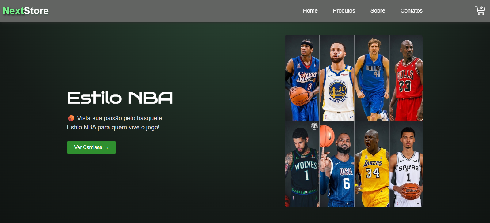

# 👕 NextStore - Loja de Camisetas
Projeto de uma loja virtual de camisetas desenvolvido com foco em Front-End.

A aplicação simula uma experiência de compra, permitindo visualizar os produtos, escolher tamanhos, alterar quantidades e adicionar itens ao carrinho.

⚠️ Este projeto é apenas uma demonstração de Front-End.
Não possui sistema de login, banco de dados ou processamento de pagamentos reais.
## 🛍️ Funcionalidades
👕 Visualização das camisetas disponíveis 
🔎 Visualização detalhada dos produtos 
📏 Seleção de tamanho 
🔢 Seleção de quantidade 
🛒 Adição de produtos ao carrinho 
➕ Aumento da quantidade de produtos 
➖ Diminuição da quantidade de produtos 
🗑️ Remoção de produtos do carrinho 
💰 Cálculo automático do subtotal 
💵 Cálculo automático do valor total da compra 
📱 Interface responsiva para diferentes tamanhos de tela 

# 🚀 Tecnologias utilizadas
### O projeto utiliza:
* HTML5
* CSS3
* JavaScript
* Git
* Github

### Estrutura do projeto

NextStore/ 
│ 
├── .venv/ 
│ 
├── js/ 
│  &nbsp;&nbsp;&nbsp;&nbsp; ├── camisas.js 
│  &nbsp;&nbsp;&nbsp;&nbsp; ├── carrinho.js 
│  &nbsp;&nbsp;&nbsp;&nbsp; ├── menu.js 
│  &nbsp;&nbsp;&nbsp;&nbsp; └── produtos.js 
│ 
├── styles/ 
│  &nbsp;&nbsp;&nbsp;&nbsp;  ├── camisa.css 
│   &nbsp;&nbsp;&nbsp;&nbsp; ├── carrinho.css 
│   &nbsp;&nbsp;&nbsp;&nbsp; ├── global.css 
│   &nbsp;&nbsp;&nbsp;&nbsp; └── produtos.css 
│ 
├── img/ 
│   &nbsp;&nbsp;&nbsp;&nbsp; ├── atlanta-hawks/ 
│   &nbsp;&nbsp;&nbsp;&nbsp; ├── boston-celtics/ 
│   &nbsp;&nbsp;&nbsp;&nbsp; ├── brooklyn-nets/ 
│   &nbsp;&nbsp;&nbsp;&nbsp; ├── charlotte-hornets/ 
│   &nbsp;&nbsp;&nbsp;&nbsp;  ├── chicago-bulls/ 
│   &nbsp;&nbsp;&nbsp;&nbsp;  ├── cleveland-cavaliers/ 
│   &nbsp;&nbsp;&nbsp;&nbsp; ├── dallas-mavericks/ 
│  &nbsp;&nbsp;&nbsp;&nbsp; ├── denver-nuggets/ 
│  &nbsp;&nbsp;&nbsp;&nbsp; ├── detroit-pistons/ 
│  &nbsp;&nbsp;&nbsp;&nbsp; ├── golden-state-warriors/ 
│  &nbsp;&nbsp;&nbsp;&nbsp; ├── houston-rockets/ 
│   &nbsp;&nbsp;&nbsp;&nbsp; ├── indiana-pacers/ 
│   &nbsp;&nbsp;&nbsp;&nbsp; ├── la-clippers/ 
│   &nbsp;&nbsp;&nbsp;&nbsp; ├── los-angeles-lakers/ 
│  &nbsp;&nbsp;&nbsp;&nbsp; ├── memphis-grizzlies/ 
│  &nbsp;&nbsp;&nbsp;&nbsp; ├── miami-heat/ 
│  &nbsp;&nbsp;&nbsp;&nbsp; ├── milwaukee-bucks/ 
│  &nbsp;&nbsp;&nbsp;&nbsp; ├── minnesota-timberwolves/ 
│  &nbsp;&nbsp;&nbsp;&nbsp; ├── new-orleans-pelicans/ 
│   &nbsp;&nbsp;&nbsp;&nbsp; ├── new-york-knicks/ 
│  &nbsp;&nbsp;&nbsp;&nbsp; ├── oklahoma-city-thunder/ 
│  &nbsp;&nbsp;&nbsp;&nbsp; ├── orlando-magic/ 
│  &nbsp;&nbsp;&nbsp;&nbsp; ├── philadelphia-76ers/ 
│  &nbsp;&nbsp;&nbsp;&nbsp; ├── phoenix-suns/ 
│  &nbsp;&nbsp;&nbsp;&nbsp; ├── portland-trail-blazers/ 
│  &nbsp;&nbsp;&nbsp;&nbsp; ├── sacramento-kings/ 
│  &nbsp;&nbsp;&nbsp;&nbsp; ├── san-antonio-spurs/ 
│  &nbsp;&nbsp;&nbsp;&nbsp; ├── toronto-raptors/ 
│  &nbsp;&nbsp;&nbsp;&nbsp; ├── utah-jazz/ 
│  &nbsp;&nbsp;&nbsp;&nbsp; └── washington-wizards/ 
│ 
├── camisas.html 
├── carrinho.html 
├── index.html 
├── produtos.html 
├── README.md 
└── .gitignore 

## 💻 Como executar
* Clone este repositório  
    * git clone URL_DO_SEU_REPOSITORIO
* Entre na pasta do projeto
    * cd loja-camisas
* Abra o projeto
    * Abra o arquivo index.html no navegador.
    * Não é necessário instalar nenhuma dependência ou configurar um servidor.

### 🛒 Funcionamento do carrinho

* Usuário pode escolher uma camiseta, selecionar o tamanho e a quantidade desejada.

* Ao adicionar o produto ao carrinho, o sistema apresenta as informações do item e calcula automaticamente os valores.

  Exemplo 
  Camiseta Preta 
  Tamanho: M 
  Quantidade: 2 
  Preço: R$ 199,00

  Subtotal: R$ 398,00

* O valor total é atualizado conforme a quantidade dos produtos é alterada.

### 🔐 Login e banco de dados

Este projeto não possui sistema de autenticação ou banco de dados.

Todas as funcionalidades são executadas no navegador utilizando JavaScript.

### 💳 Pagamento

O projeto não realiza pagamentos reais.

O processo de compra é apenas uma simulação para demonstrar as funcionalidades de uma loja virtual no Front-End.

## 📱 Responsividade

A interface foi desenvolvida para funcionar em diferentes tamanhos de tela, incluindo:

💻 Computadores 
💻 Notebooks 
📱 Tablets 
📱 Celulares 

## 🎯 Objetivo do projeto

* O objetivo deste projeto é praticar e demonstrar conhecimentos de desenvolvimento Front-End, principalmente:

    * Estruturação de páginas com HTML
    * Estilização com CSS
    * Manipulação do DOM
    * Eventos com JavaScript
    * Lógica de carrinho de compras
    * Cálculos dinâmicos
    * Design responsivo

## 📸 Preview

## 👨‍💻 Autor

Desenvolvido por **Patrick Eleoterio**.

GitHub/Eleoteriop

### ⭐ Se você gostou do projeto, deixe uma estrela no repositório!

# ⚠️ Direitos de Uso
**Este projeto foi desenvolvido para fins de estudo e portfólio.**

**Logos, nomes, imagens e demais elementos relacionados às equipes da NBA materiais comercialmente, verifique as respectivas licenças e permissões.**